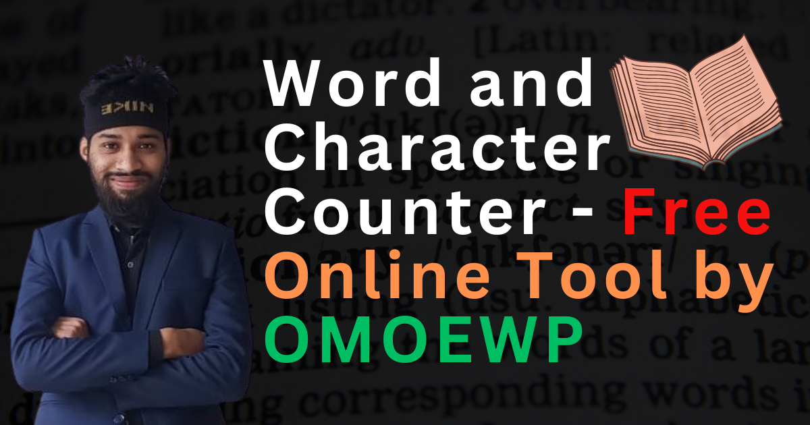

# Word & Character Counter

A simple web tool to count words, characters (with and without spaces) in your text.

 <!-- Add a screenshot later -->

## Features
- Real-time counting
- Responsive design
- Clean, user-friendly interface
- Counts words, characters (with/without spaces)

## How to Use
1. Type or paste your text in the textarea
2. See instant counts below

## Live Demo
[View Demo](https://www.omoewp.com/word-counter/)

## License
https://github.com/mdshoyebhossain/Word-and-Character-Counter/blob/main/LICENSE.md
